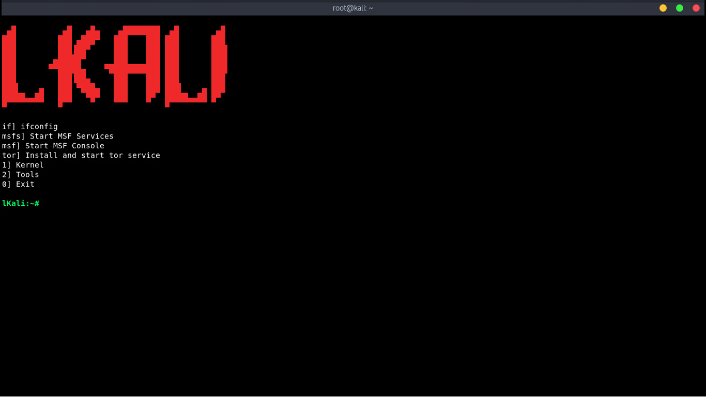

<h1 align="center">lKali</h1>
<p align="center">
  Lazy Script for Kali Linux written in python<br>
</p>

## PREREQUISITES
* *Python 2.7*

## TESTED ON
* **Kali Linux - Rolling Edition**

## INSTALLATION
```
git clone https://github.com/Assassinumz/lKAli.git
cd lKali
chmod +x install.sh && ./install.sh
lkali
```

## SCREENSHOT
<div align="center">
  
</div>

## Have any questions ?
* Ask me on [Discord](https://discord.gg/3nfQadt)
